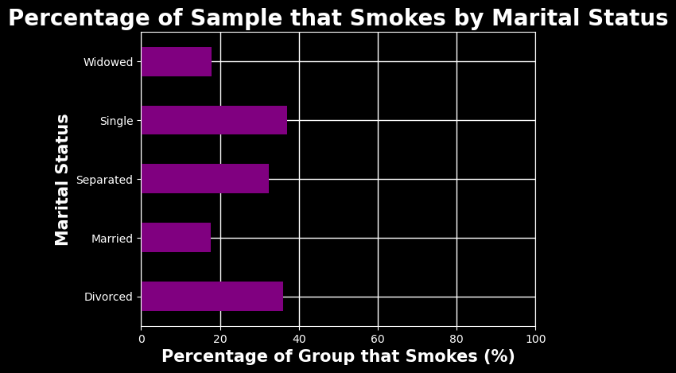
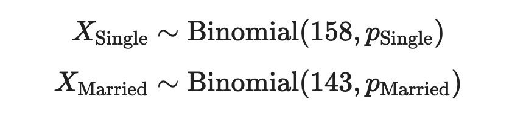
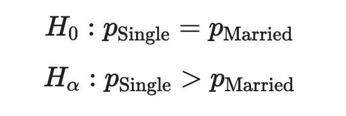
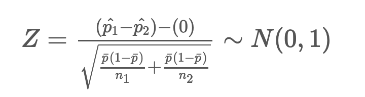
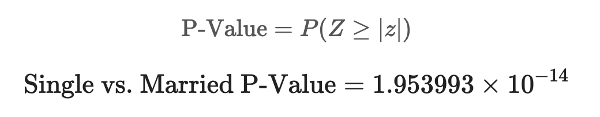
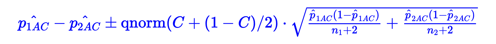
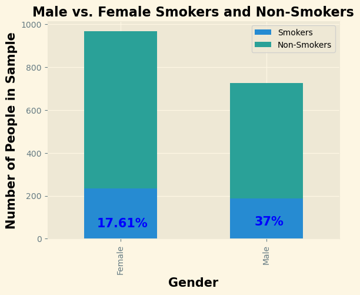

# UK Smoking Data Analysis

(In Progress) Project: [/uk_smoking_analysis/uk_smoking.html](https://github.com/garrettcbert/uk_smoking_analysis/blob/main/uk_smoking.html)

Data pulled from <a href = https://www.stem.org.uk/resources/elibrary/resource/28452/large-datasets-stats4schools>Stem.org.uk</a> and published by Stats4Schools

## Introduction
We have worked hard as a society to abolish smoking as a socially accepted tool. That being said, many still struggle with a smoking addiction, creating lasting effects on population health, and potentially drastically shortening lifespans. Our surroundings often play a large role in determining the type of lifestyle that we choose to live. Your gender, your marital status, and even your education level may heavily impact your decisions and habits. For better or for worse, the opinions of those around us and the surroundings that we find ourselves in can certainly influence us. What factor of life plays the most substantial role in pushing someone towards this habit and what can we do with this information to get people out of a lifetime of smoking?

In this report, I make a statistical conclusion about the effects that marital status, gender, and education level can have on the probability that someone smokes. This data was exclusively collected from a sample of people who live in the UK, so any conclusions made are made exclusively about the population of people who live in the United Kingdom.

## Background
This data was put together by Stats4Schools and was collected from <a href = "https://www.stem.org.uk/resources/elibrary/resource/28452/large-datasets-stats4schools">stem.org.uk</a>. The dataset includes many variables that potentially play a role in determining the probability that someone smokes tobacco. The variables used in this investigation include:

<ul>
    <li><b>marital_status:</b> Marital Status (Divorced, Married, Single, etc.)</li>
    <li><b>gender:</b> (Male, Female)</li>
    <li><b>highest_qualification:</b> Highest Level of Education</li>
    <li><b>smoke: </b> Whether or not the person smokes (Yes, No)</li>
</ul>

The `smoke` column will be modified to contain ones and zeros. (1 = Yes, 0 = No)

  

# Inference on Difference of Proportion of Smokers

## **Part 1:** Married vs. Single

For the sake of simplicity, and drawing real conclusions, we will just focus on the single and the married people in the `marital_status` column. At least from our sample and as you can see from the graph above, these two groups have the greatest difference in proportions. To conclude the respective percentages from the population, we can conduct a hypothesis test as well as a confidence interval.

The graph below shows the number of smokers and non-smokers we have in our dataset from the `Single` and `Married` categories. The total number of smokers in both is very similar but the percentage of the total number is much different. 

<table border="1" class="dataframe">
<thead>
<tr style="text-align: right;">
<th></th>
<th>total</th>
<th>total_smoke</th>
<th>non_smoke</th>
<th>perc_smoke</th>
</tr>
<tr>
<th>marital_status</th>
<th></th>
<th></th>
<th></th>
<th></th>
</tr>
</thead>
<tbody>
<tr>
<th>Married</th>
<td>812</td>
<td>143</td>
<td>669</td>
<td>17.610837</td>
</tr>
<tr>
<th>Single</th>
<td>427</td>
<td>158</td>
<td>269</td>
<td>37.002342</td>
</tr>
</tbody>
</table>

  <h2 style="color: #4CAF50; text-align: left; border-bottom: 2px solid #ddd; padding-bottom: 5px;">Hypothesis Testing</h2>
  
  

    Using a significance level of 0.05
  

  <h3 style="color: #4CAF50; text-align: left; margin-top: 20px;">Step 1: Model Statement</h3>

  

  <h3 style="color: #4CAF50; text-align: left; margin-top: 20px;">Step 2: State Hypotheses</h3>

  

  <h3 style="color: #4CAF50; text-align: left; margin-top: 20px;">Step 3: Test Statistic and Null Distribution</h3>
  

    <b>Test Statistic and Null Distribution for Difference of Proportions:</b>
  

  

  <h3 style="color: #4CAF50; text-align: left; margin-top: 20px;">Step 4: Identify Relevant Outcomes</h3>

  

  <h3 style="color: #4CAF50; text-align: left; margin-top: 20px;">Step 5: Calculate a P-Value</h3>

  

  <h3 style="color: #4CAF50; text-align: left; margin-top: 20px;">Step 6: Interpret in Context</h3>
  

    Our calculated P-Value is much smaller than our significance level of 0.05, providing significant evidence that the true proportion of single people who smoke in the UK is not equal to the proportion of married people who smoke. 
  

  

    Although it may already be clear which proportion is likely larger, we can confirm this using a confidence interval.
  

  <h2 style="color: lightblue; text-align: left; border-bottom: 2px solid #ddd; padding-bottom: 5px;">Confidence Interval (C = 0.95)</h2>
  
  
General Formula for Confidence Interval:

  

  
Confidence Interval for Difference in Proportions:

  

    Using the <b>Agresti-Coull Adjustment:</b>
  

  

  

  <h2 style="color: purple; text-align: left; border-bottom: 2px solid #ddd; padding-bottom: 5px;">Conclusion:</h2>
  

    The confidence interval created using a 95% confidence level is heavily shifted to the right and does not include zero. This provides strong evidence that the true proportion of single smokers in the UK is greater than the true proportion of married smokers in the UK.
  

## **Part 2:** Male vs. Female 

An argument could be made that gender plays a role in determining whether someone might take up smoking. Certain societal pressures could provoke an addiction based on sex, but by looking at the sample data the percentages look similar enough for an argument to be made for the difference to be negligable. That being said we can perform the same kind of statistical hypothesis testing to create evidence to point towards the population proportions.

<table border="1" class="dataframe">
<thead>
<tr style="text-align: right;">
<th></th>
<th>total_smoke</th>
<th>total</th>
<th>perc_smoke</th>
<th>non_smoke</th>
</tr>
<tr>
<th>gender</th>
<th></th>
<th></th>
<th></th>
<th></th>
</tr>
</thead>
<tbody>
<tr>
<th>Female</th>
<td>234</td>
<td>965</td>
<td>0.242487</td>
<td>731</td>
</tr>
<tr>
<th>Male</th>
<td>187</td>
<td>726</td>
<td>0.257576</td>
<td>539</td>
</tr>
</tbody>
</table>

  

